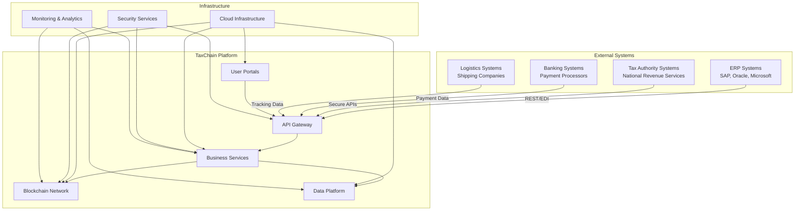
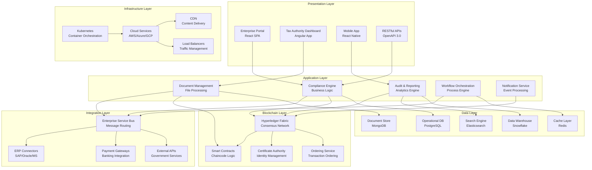
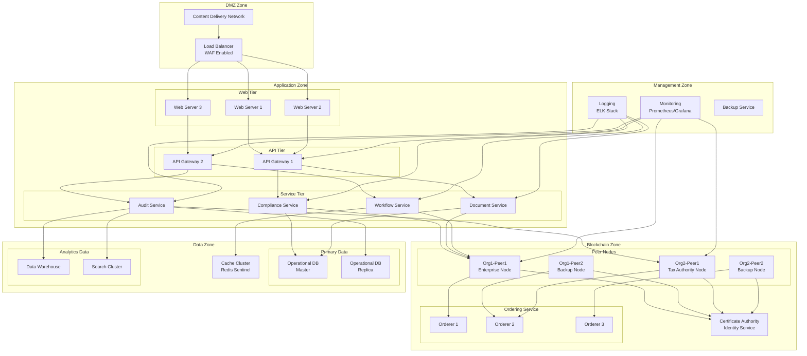
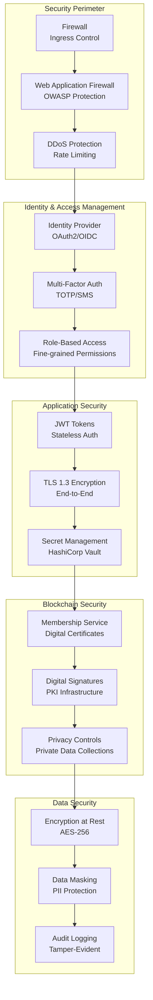
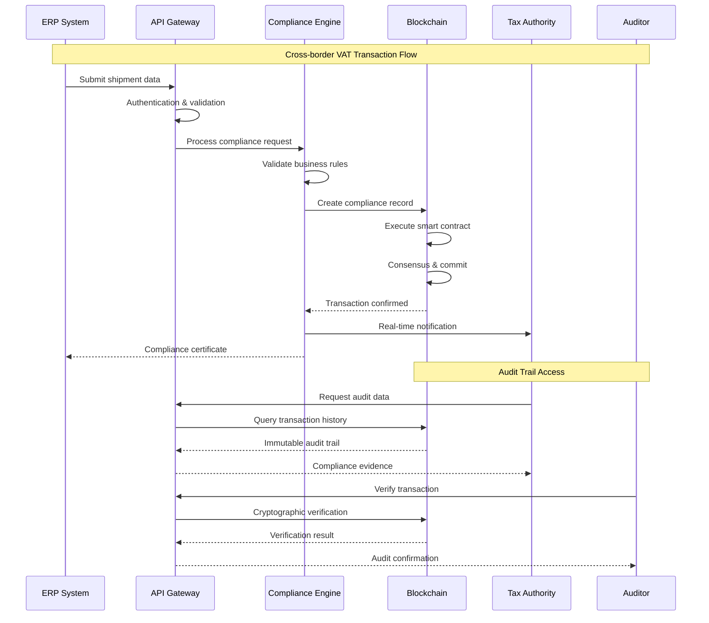
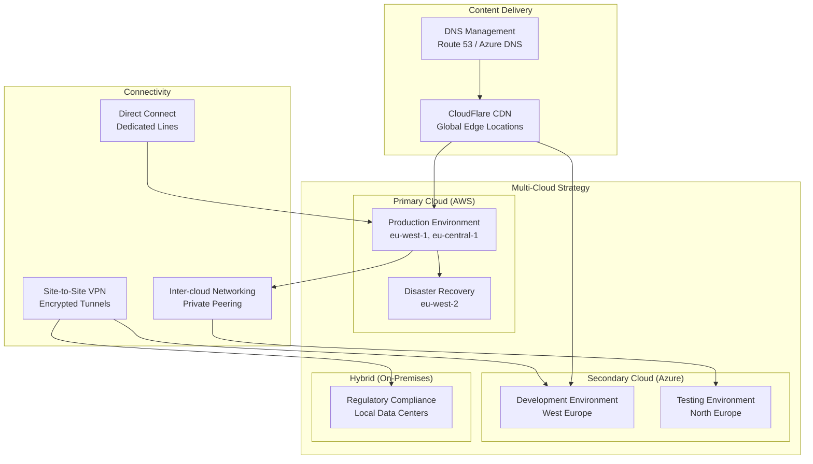

# TaxChain High-Level Architecture Overview

## Architecture Context Diagram

## Layered Architecture View

## Network Architecture Topology

## Security Architecture

## Data Flow Architecture

## Deployment Architecture

## Technology Stack Overview

### Frontend Technologies
- **Web Applications**: React 18, TypeScript, Material-UI
- **Mobile Applications**: React Native, Expo
- **State Management**: Redux Toolkit, React Query
- **Build Tools**: Vite, Webpack 5

### Backend Technologies
- **API Gateway**: Kong, nginx
- **Microservices**: Node.js (Express), Go (Gin), Java (Spring Boot)
- **Message Queues**: Apache Kafka, RabbitMQ
- **Caching**: Redis Cluster, Memcached

### Blockchain Platform
- **Network**: Hyperledger Fabric 2.4+
- **Smart Contracts**: Go, JavaScript (Node.js)
- **Identity Management**: Fabric CA, HSM integration
- **Consensus**: Raft ordering service

### Data Technologies
- **Operational Database**: PostgreSQL 14+, MongoDB
- **Analytics**: Apache Spark, Snowflake
- **Search**: Elasticsearch, Apache Solr
- **Streaming**: Apache Kafka, Apache Pulsar

### Infrastructure & DevOps
- **Container Platform**: Kubernetes, Docker
- **Service Mesh**: Istio
- **CI/CD**: GitLab CI, Jenkins, ArgoCD
- **Monitoring**: Prometheus, Grafana, ELK Stack

### Security Stack
- **Identity**: Auth0, Azure AD, HashiCorp Vault
- **Network**: AWS WAF, Cloudflare Security
- **Scanning**: SonarQube, Snyk, Twistlock
- **Compliance**: Falco, OPA (Open Policy Agent)

## Architecture Decision Rationale

### Technology Choices
1. **Hyperledger Fabric** chosen for:
   - Permissioned network model (regulatory requirement)
   - Private data collections (privacy compliance)
   - Mature enterprise features
   - Strong governance model

2. **Microservices Architecture** selected for:
   - Independent scaling and deployment
   - Technology diversity (polyglot programming)
   - Fault isolation and resilience
   - Team autonomy and velocity

3. **Multi-Cloud Strategy** adopted for:
   - Vendor independence and negotiation power
   - Regulatory data residency requirements
   - Disaster recovery and high availability
   - Risk mitigation

### Design Patterns
- **API Gateway Pattern**: Centralized cross-cutting concerns
- **Event Sourcing**: Immutable audit trail creation
- **CQRS**: Separate read/write optimization
- **Saga Pattern**: Distributed transaction management
- **Circuit Breaker**: Fault tolerance and resilience

## Performance & Scalability Targets

### Performance Requirements
- **API Response Time**: <500ms (95th percentile)
- **Blockchain Transaction**: <3 seconds confirmation
- **Batch Processing**: 10,000 transactions/hour
- **Concurrent Users**: 5,000 simultaneous sessions

### Scalability Projections
- **Year 1**: 100K transactions/month
- **Year 2**: 1M transactions/month  
- **Year 3**: 10M transactions/month
- **Geographic**: 27 EU countries support

### Availability Requirements
- **System Uptime**: 99.9% (8.76 hours downtime/year)
- **Blockchain Network**: 99.95% availability
- **Data Recovery**: RTO < 4 hours, RPO < 1 hour

---

**Architecture Owner**: Enterprise Architect  
**Technical Leads**: Platform Architecture Team  
**Last Updated**:   
**Next Review**: Phase B - Business Architecture Kickoff