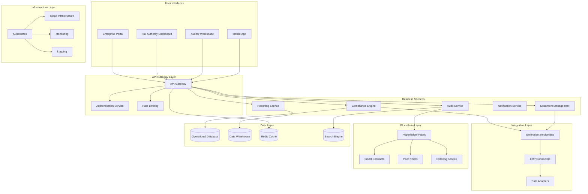

# TaxChain Architecture Vision

## Vision Statement

**"To create Europe's first blockchain-based VAT compliance ecosystem that transforms cross-border tax administration through automated, transparent, and immutable evidence management, enabling seamless trade while eliminating fraud and reducing administrative burden by 40%."**

## Architecture Objectives

### Primary Objectives

#### 1. Regulatory Compliance Excellence
- **Goal**: Achieve 100% compliance with EU VAT directives and national tax regulations
- **Measures**: Zero non-compliance incidents, automated regulatory reporting, real-time compliance validation
- **Architecture Impact**: Compliance-first design patterns, automated rule engines, audit trail integration

#### 2. Fraud Prevention & Transparency  
- **Goal**: Reduce VAT fraud by 87% through immutable evidence trails
- **Measures**: Cryptographic proof verification, real-time fraud detection, tamper-evident documentation
- **Architecture Impact**: Blockchain immutability, cryptographic hashing, distributed consensus

#### 3. Operational Efficiency
- **Goal**: Reduce administrative costs by 40% and processing time by 60%
- **Measures**: Automated workflows, self-service capabilities, straight-through processing
- **Architecture Impact**: Event-driven architecture, API-first design, workflow orchestration

#### 4. Ecosystem Integration
- **Goal**: Seamless integration with existing ERP and tax systems across EU
- **Measures**: 95% successful integrations, <6 month implementation cycles, API adoption metrics
- **Architecture Impact**: Standard APIs, microservices, enterprise service bus patterns

### Secondary Objectives

#### 5. Scalability & Performance
- **Goal**: Support pan-European transaction volumes with sub-second response times
- **Measures**: 99.9% availability, <1 second transaction processing, elastic scaling
- **Architecture Impact**: Cloud-native design, horizontal scaling, distributed architecture

#### 6. Security & Privacy
- **Goal**: Maintain highest security standards while ensuring data privacy compliance
- **Measures**: Zero security breaches, GDPR compliance, penetration test scores
- **Architecture Impact**: Zero-trust security, encryption at rest and in transit, privacy by design

## High-Level Architecture Overview

## Architecture Principles Application

### Business Principles
1. **Regulatory Compliance First** 
   - Compliance validation at every transaction point
   - Automated regulatory reporting capabilities
   - Real-time compliance monitoring

2. **Transparency by Design**
   - All transactions recorded on immutable ledger
   - Audit trails accessible to authorized parties
   - Public verification mechanisms for compliance

3. **Data Sovereignty**
   - National data residency requirements
   - Jurisdiction-specific access controls
   - Local regulatory compliance

### Data Principles
4. **Immutable Audit Trail**
   - Blockchain-based transaction recording
   - Cryptographic proof of data integrity
   - Tamper-evident document storage

5. **Privacy by Design**
   - Data minimization principles
   - Pseudonymization of sensitive data
   - GDPR compliance built-in

6. **Single Source of Truth**
   - Centralized compliance event recording
   - Authoritative data repository
   - Conflict resolution mechanisms

### Application Principles
7. **API-First Design**
   - RESTful API interfaces
   - OpenAPI specifications
   - Developer-friendly SDKs

8. **Microservices Architecture**
   - Domain-driven service boundaries
   - Independent deployment capabilities
   - Fault isolation and resilience

9. **Cloud Native**
   - Container-based deployment
   - Kubernetes orchestration
   - Auto-scaling capabilities

### Technology Principles
10. **Open Standards**
    - Hyperledger Fabric blockchain
    - Standard integration protocols
    - Industry-standard APIs

11. **Security by Default**
    - Zero-trust architecture
    - End-to-end encryption
    - Multi-factor authentication

12. **Vendor Independence**
    - Abstraction layers for vendor services
    - Multi-cloud deployment capability
    - Standard protocols and formats

## Target State Architecture Characteristics

### Functional Characteristics
- **Automated Compliance**: 95% of compliance tasks automated
- **Real-time Processing**: Sub-second transaction validation
- **Multi-jurisdiction Support**: All 27 EU member states
- **Multi-language Support**: 24 official EU languages

### Non-Functional Characteristics
- **Availability**: 99.9% uptime (8.76 hours downtime/year)
- **Performance**: <1 second API response time
- **Scalability**: Support 1M+ transactions/day
- **Security**: ISO 27001, SOC 2 Type II compliance
- **Usability**: <30 minutes user onboarding time

### Integration Characteristics
- **ERP Integration**: SAP, Oracle, Microsoft, Odoo support
- **API Standards**: REST, GraphQL, WebSocket support  
- **Data Formats**: JSON, XML, EDI support
- **Protocol Support**: HTTPS, SFTP, message queues

## Success Criteria

### Business Success Metrics
1. **Compliance Improvement**
   - 100% regulatory compliance achievement
   - Zero compliance violations
   - 50% faster audit cycles

2. **Fraud Reduction**
   - 87% reduction in VAT fraud incidents
   - 99.7% transaction verification accuracy
   - Real-time fraud detection

3. **Cost Reduction**
   - 40% reduction in administrative costs
   - 60% reduction in processing time
   - 30% reduction in audit costs

### Technical Success Metrics
1. **System Performance**
   - 99.9% system availability
   - <1 second average response time
   - 100% successful transaction processing

2. **Integration Success**
   - 95% successful ERP integrations
   - <6 month average implementation time
   - 100% API uptime

3. **Security & Compliance**
   - Zero security breaches
   - 100% GDPR compliance
   - Annual security certification

### User Adoption Metrics
1. **Enterprise Adoption**
   - 1000+ enterprises onboarded (Year 1)
   - 90% user satisfaction score
   - <30 minutes average onboarding time

2. **Transaction Volume**
   - 1M+ transactions processed monthly
   - 50+ participating organizations
   - 27 EU countries supported

## Architecture Evolution Roadmap

### Phase 1: Foundation (Months 1-6)
- Core blockchain platform deployment
- Basic compliance engine
- Pilot ERP integrations
- Initial tax authority partnerships

### Phase 2: Scale (Months 7-12)
- Multi-country expansion
- Advanced analytics capabilities
- Mobile applications
- Enhanced security features

### Phase 3: Innovation (Months 13-18)
- AI/ML fraud detection
- Advanced reporting capabilities
- API ecosystem development
- Third-party integrations

## Risk Mitigation Through Architecture

### Technical Risks
- **Platform Risk**: Multi-cloud deployment strategy
- **Performance Risk**: Horizontal scaling architecture
- **Security Risk**: Zero-trust security model
- **Integration Risk**: Standard API specifications

### Business Risks
- **Regulatory Risk**: Compliance-first design approach
- **Adoption Risk**: User-centric interface design
- **Competition Risk**: Open ecosystem approach
- **Market Risk**: Flexible, configurable architecture

---

**Vision Owner**: Chief Technology Officer  
**Architecture Owner**: Enterprise Architect  
**Last Updated**:  
**Next Review**: Quarterly architecture review