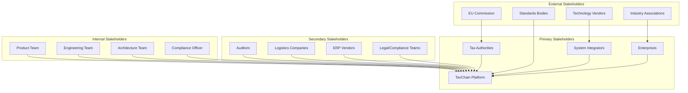
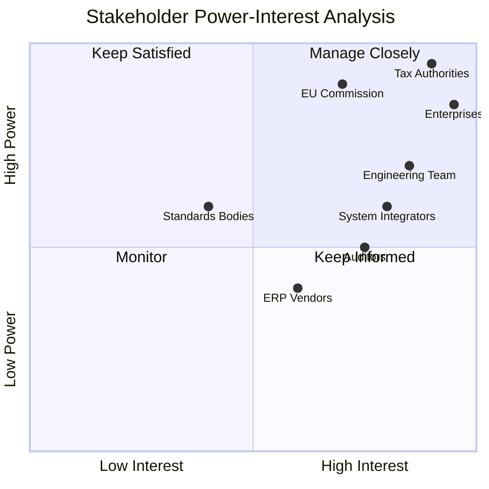
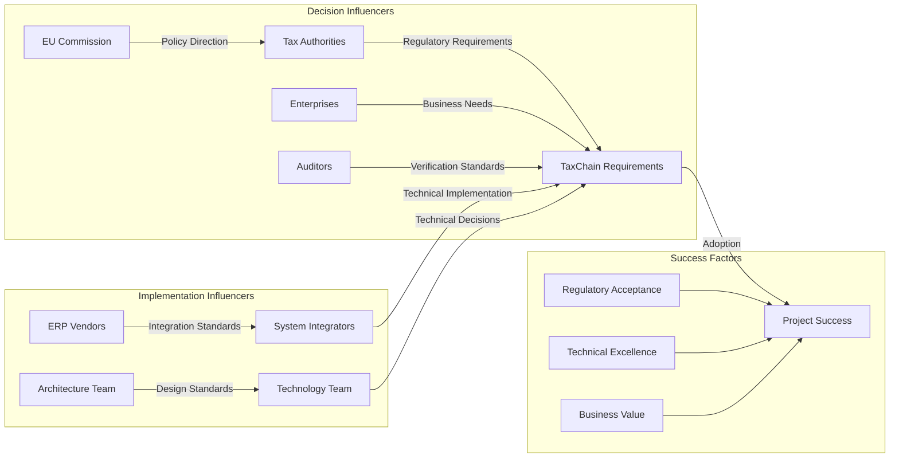

# TaxChain Stakeholder Map

## Stakeholder Network Diagram

## Stakeholder Analysis Matrix

### Power-Interest Grid

## Detailed Stakeholder Profiles

### Primary Stakeholders

#### Enterprises (Manufacturing, Trading Companies)
**Key Concerns:**
- Compliance cost reduction
- System integration complexity
- Business process disruption
- ROI timeline

**Success Criteria:**
- <40% reduction in compliance costs
- Seamless ERP integration
- <6 month implementation
- 99.9% system uptime

**Engagement Strategy:**
- Regular user workshops
- Beta testing programs
- ROI reporting
- Training and support

#### Tax Authorities (National Revenue Services)
**Key Concerns:**
- Fraud prevention effectiveness
- Audit trail integrity
- Cross-border cooperation
- Legal compliance

**Success Criteria:**
- 87% fraud reduction
- Real-time audit access
- Cryptographic verification
- Regulatory compliance

**Engagement Strategy:**
- Governance participation
- Pilot program collaboration
- Regular compliance reviews
- Technical working groups

#### System Integrators (SI Partners)
**Key Concerns:**
- Implementation complexity
- Skills requirements
- Business opportunity size
- Support model

**Success Criteria:**
- Clear integration patterns
- Comprehensive documentation
- Certification programs
- Revenue opportunities

**Engagement Strategy:**
- Partner enablement
- Technical certification
- Reference architectures
- Co-innovation programs

### Secondary Stakeholders

#### Auditors (External Audit Firms)
**Key Concerns:**
- Evidence verification
- Audit trail completeness
- Professional liability
- Tool compatibility

**Requirements:**
- Cryptographic verification tools
- Audit trail export capabilities
- Professional training
- Compliance certification

#### Logistics Companies
**Key Concerns:**
- Operational integration
- Data sharing requirements
- Liability exposure
- Process changes

**Requirements:**
- API integrations
- Real-time updates
- Data privacy protection
- Minimal process disruption

#### ERP Vendors (SAP, Oracle, Microsoft)
**Key Concerns:**
- Integration standards
- Competitive positioning
- Development resources
- Customer demand

**Requirements:**
- Standard APIs
- Reference implementations
- Joint go-to-market
- Technical support

### Stakeholder Communication Plan

| Stakeholder | Communication Method | Frequency | Key Messages |
|-------------|---------------------|-----------|--------------|
| Tax Authorities | Governance meetings, compliance reports | Monthly | Fraud reduction, audit efficiency |
| Enterprises | User groups, newsletters, dashboards | Bi-weekly | Cost savings, ROI, ease of use |
| System Integrators | Technical forums, certification | Monthly | Implementation guidance, opportunities |
| Auditors | Training sessions, documentation | Quarterly | Verification tools, compliance |
| EU Commission | Policy briefings, reports | Quarterly | Innovation, standards compliance |
| Internal Teams | Sprint reviews, architecture boards | Weekly | Technical progress, decisions |

## Influence Network Analysis

## Risk Assessment by Stakeholder

### High Risk Stakeholders
**Tax Authorities**
- Risk: Regulatory non-acceptance
- Mitigation: Continuous engagement, compliance-first design

**Enterprises**  
- Risk: Low adoption due to complexity
- Mitigation: Simplified interfaces, comprehensive training

### Medium Risk Stakeholders
**System Integrators**
- Risk: Insufficient skills/resources
- Mitigation: Certification programs, reference architectures

**ERP Vendors**
- Risk: Competing priorities
- Mitigation: Partnership agreements, joint value propositions

### Stakeholder Success Metrics

| Stakeholder | Key Performance Indicators | Target |
|-------------|---------------------------|---------|
| Tax Authorities | Fraud detection rate, audit efficiency | >87% fraud reduction, 60% faster audits |
| Enterprises | Cost reduction, process efficiency | 40% cost savings, 95% automation |
| System Integrators | Implementation success rate | >90% successful implementations |
| Auditors | Verification accuracy | 99.7% accurate evidence verification |

---

**Next Review:** Quarterly stakeholder assessment
**Owner:** Product Management Team  
**Last Updated:** 