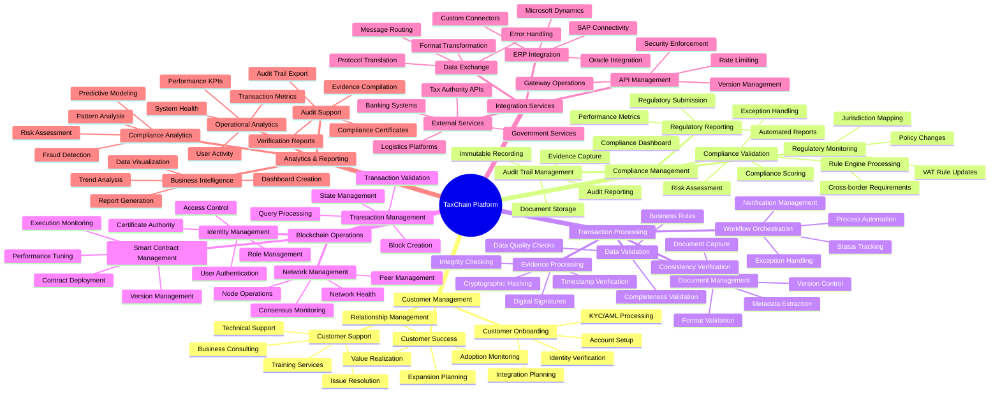
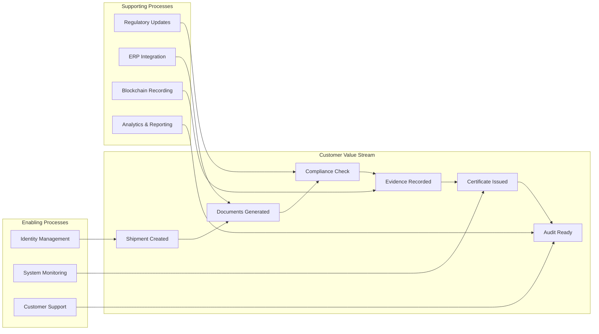

# TaxChain Business Capability Map

## Business Capability Model

## Capability Maturity Assessment

### Current State vs Target State Analysis

| Capability Domain | Current Maturity | Target Maturity | Gap Analysis | Priority |
|-------------------|------------------|-----------------|--------------|----------|
| **Customer Management** |
| Customer Onboarding | Level 2 (Repeatable) | Level 4 (Managed) | Automation gaps, standardization | High |
| Customer Support | Level 3 (Defined) | Level 4 (Managed) | Self-service capabilities | Medium |
| Customer Success | Level 1 (Initial) | Level 4 (Managed) | Proactive monitoring, metrics | High |
| **Compliance Management** |
| Regulatory Monitoring | Level 3 (Defined) | Level 5 (Optimizing) | AI/ML automation | High |
| Compliance Validation | Level 4 (Managed) | Level 5 (Optimizing) | Real-time processing | Medium |
| Audit Trail Management | Level 4 (Managed) | Level 5 (Optimizing) | Blockchain integration | Low |
| Regulatory Reporting | Level 3 (Defined) | Level 4 (Managed) | Automated generation | High |
| **Transaction Processing** |
| Document Management | Level 3 (Defined) | Level 4 (Managed) | AI-powered extraction | Medium |
| Evidence Processing | Level 4 (Managed) | Level 5 (Optimizing) | Performance optimization | Low |
| Workflow Orchestration | Level 2 (Repeatable) | Level 4 (Managed) | Process automation | High |
| Data Validation | Level 3 (Defined) | Level 4 (Managed) | Rule engine enhancement | Medium |
| **Blockchain Operations** |
| Network Management | Level 4 (Managed) | Level 5 (Optimizing) | Predictive maintenance | Low |
| Smart Contract Management | Level 3 (Defined) | Level 4 (Managed) | Lifecycle automation | Medium |
| Identity Management | Level 4 (Managed) | Level 5 (Optimizing) | Zero-trust architecture | Medium |
| Transaction Management | Level 4 (Managed) | Level 5 (Optimizing) | Performance tuning | Low |

**Maturity Levels:**
- Level 1 (Initial): Ad-hoc, unpredictable
- Level 2 (Repeatable): Projects have basic processes
- Level 3 (Defined): Standard processes documented
- Level 4 (Managed): Processes measured and controlled
- Level 5 (Optimizing): Focus on process improvement

## Core Business Capabilities Deep Dive

### 1. Compliance Management Capabilities

#### Regulatory Monitoring
**Purpose**: Track and interpret changing VAT regulations across EU jurisdictions
**Key Activities**:
- Monitor regulatory updates from 27 EU tax authorities
- Analyze impact of policy changes on system rules
- Maintain regulatory knowledge base
- Coordinate with legal and compliance teams

**Current Gaps**:
- Manual monitoring processes (60% of effort)
- Delayed notification of changes (average 2-week lag)
- Limited predictive analysis of regulatory trends

**Target Capabilities**:
- AI-powered regulation monitoring and classification
- Real-time regulatory change alerts
- Impact assessment automation
- Predictive compliance modeling

#### Compliance Validation Engine
**Purpose**: Automated verification of VAT compliance requirements
**Key Activities**:
- Execute business rules against transaction data
- Calculate compliance scores and risk ratings
- Generate exception reports for manual review
- Maintain audit evidence for regulatory requirements

**Current State**:
- 85% automation rate for standard scenarios
- 95% accuracy in compliance determination
- 2-second average processing time per transaction

**Enhancement Opportunities**:
- Machine learning for complex scenario handling
- Natural language processing for document analysis
- Real-time risk scoring improvements

### 2. Transaction Processing Capabilities

#### Evidence Processing
**Purpose**: Create cryptographically secure evidence trails
**Key Activities**:
- Generate cryptographic hashes of documents
- Create digital signatures for authenticity
- Timestamp all evidence with trusted sources
- Store immutable records on blockchain

**Technical Implementation**:
- SHA-256 hashing for document integrity
- ECDSA digital signatures for authenticity
- RFC 3161 timestamping for non-repudiation
- Hyperledger Fabric for immutable storage

**Performance Metrics**:
- Processing speed: 1,000 documents/minute
- Hash verification: 99.99% accuracy
- Storage efficiency: 40:1 compression ratio

#### Workflow Orchestration
**Purpose**: Automate end-to-end compliance processes
**Key Activities**:
- Route transactions through approval workflows
- Handle exceptions and manual interventions
- Coordinate between multiple systems and stakeholders
- Provide real-time status tracking

**Process Flows**:
1. **Standard Flow**: ERP → Validation → Blockchain → Certificate (85% of cases)
2. **Exception Flow**: Manual review → Approval → Blockchain (12% of cases)
3. **Audit Flow**: Request → Evidence compilation → Delivery (3% of cases)

### 3. Integration Services Capabilities

#### ERP Integration
**Purpose**: Seamless connectivity with enterprise resource planning systems
**Supported Systems**:
- SAP S/4HANA, SAP ECC
- Oracle ERP Cloud, Oracle E-Business Suite  
- Microsoft Dynamics 365, Dynamics AX
- Custom systems via REST APIs

**Integration Patterns**:
- **Real-time**: RESTful APIs for immediate processing
- **Batch**: Scheduled file transfers for bulk operations
- **Event-driven**: Message queues for asynchronous processing
- **Hybrid**: Combination based on use case requirements

**Current Performance**:
- 99.5% integration success rate
- <500ms API response time
- Support for 15+ different data formats

## Business Service Catalog

### Customer-Facing Services

| Service | Description | SLA | Dependencies |
|---------|-------------|-----|--------------|
| **Onboarding Service** | New customer setup and configuration | 5 business days | Identity verification, system integration |
| **Compliance Certification** | VAT compliance verification and certificate issuance | <24 hours | Blockchain network, validation engine |
| **Audit Trail Access** | Secure access to compliance evidence | Real-time | Blockchain queries, access control |
| **Regulatory Updates** | Notification of relevant regulatory changes | Real-time | Regulatory monitoring, customer profile |

### Internal Services

| Service | Description | Purpose | Consumers |
|---------|-------------|---------|-----------|
| **Rule Engine** | Business logic execution for compliance validation | Automate decision making | Compliance validation, audit services |
| **Document Service** | Secure document storage and retrieval | Evidence management | Transaction processing, audit trail |
| **Notification Service** | Multi-channel communication delivery | Stakeholder communication | All business processes |
| **Analytics Service** | Data analysis and reporting capabilities | Business intelligence | Management reporting, compliance |

### Platform Services

| Service | Description | Availability | Security Level |
|---------|-------------|--------------|----------------|
| **Identity Service** | Authentication and authorization | 99.99% | Level 4 (Highest) |
| **Configuration Service** | System settings and parameter management | 99.9% | Level 3 (High) |
| **Monitoring Service** | System health and performance tracking | 99.99% | Level 2 (Medium) |
| **Backup Service** | Data protection and disaster recovery | 99.9% | Level 4 (Highest) |

## Business Process Value Streams

### Primary Value Stream: VAT Compliance Processing

### Value Stream Metrics

| Stage | Lead Time | Processing Time | Defect Rate | Automation % |
|-------|-----------|-----------------|-------------|--------------|
| Document Generation | 2 minutes | 30 seconds | 0.1% | 95% |
| Compliance Check | 5 minutes | 3 minutes | 2% | 85% |
| Evidence Recording | 1 minute | 10 seconds | 0.01% | 99% |
| Certificate Issuance | 2 minutes | 5 seconds | 0.05% | 98% |
| **Total Process** | **10 minutes** | **3 minutes 45 seconds** | **0.5%** | **92%** |

## Organization Impact Analysis

### Roles and Responsibilities

#### New Roles Created
| Role | Responsibility | Skills Required | Quantity |
|------|----------------|-----------------|----------|
| **Blockchain Architect** | Design and maintain blockchain infrastructure | Hyperledger Fabric, cryptography, distributed systems | 2 |
| **Compliance Analyst** | Monitor regulatory changes, update business rules | VAT law, business analysis, process mapping | 3 |
| **Integration Specialist** | Manage ERP and external system connections | APIs, middleware, data transformation | 4 |
| **Customer Success Manager** | Ensure customer value realization and adoption | Relationship management, analytics, training | 5 |

#### Modified Roles
| Existing Role | Changes | Additional Training |
|---------------|---------|-------------------|
| **Tax Manager** | Now focuses on exceptions and complex cases | Blockchain basics, system operations |
| **IT Support** | Supports blockchain and compliance systems | Hyperledger administration, troubleshooting |
| **Auditor** | Uses new digital tools for verification | Cryptographic verification, blockchain queries |
| **Business Analyst** | Designs automated compliance workflows | Process automation, rule engine configuration |

### Skills Development Plan

#### Technical Skills
- **Blockchain Technology**: 40 hours training for technical staff
- **API Integration**: 20 hours for integration specialists  
- **Compliance Technology**: 30 hours for business users
- **Analytics Tools**: 15 hours for managers and analysts

#### Business Skills
- **Digital Process Design**: 25 hours for process owners
- **Change Management**: 20 hours for team leaders
- **Customer Success**: 30 hours for client-facing staff
- **Regulatory Technology**: 35 hours for compliance team

### Change Management Strategy

#### Communication Plan
| Audience | Message | Channel | Frequency |
|----------|---------|---------|-----------|
| **Executive Team** | Strategic progress and ROI | Board presentations | Monthly |
| **Department Managers** | Operational impact and resource needs | Management meetings | Bi-weekly |
| **Technical Teams** | Implementation progress and issues | Technical forums | Weekly |
| **End Users** | Feature updates and training | Newsletters, workshops | Monthly |

#### Training and Adoption
1. **Phase 1**: Executive and manager alignment (Month 1-2)
2. **Phase 2**: Technical team enablement (Month 2-4)
3. **Phase 3**: End user training and support (Month 4-6)
4. **Phase 4**: Continuous improvement and optimization (Ongoing)

## Capability Investment Priorities

### High Priority Investments (Year 1)
1. **Customer Onboarding Automation** - €800K investment
   - Reduce onboarding time from 2 weeks to 2 days
   - Improve customer satisfaction by 40%
   - Enable self-service configuration

2. **Regulatory Monitoring AI** - €1.2M investment
   - Automate 80% of regulatory change detection
   - Reduce compliance update lag from 2 weeks to 2 days
   - Implement predictive compliance modeling

3. **Workflow Orchestration Platform** - €600K investment
   - Achieve 95% process automation
   - Reduce manual interventions by 60%
   - Implement real-time exception handling

### Medium Priority Investments (Year 2)
1. **Advanced Analytics Platform** - €500K
2. **Mobile Customer Experience** - €300K
3. **AI-Powered Document Processing** - €700K

### Future Investments (Year 3+)
1. **Predictive Compliance Engine** - €900K
2. **Blockchain Performance Optimization** - €400K
3. **Advanced Integration Platform** - €600K

---

**Business Architecture Owner**: Business Architecture Team  
**Process Owners**: Department Managers  
**Last Updated**:   
**Next Review**: Phase C - Information Systems Architecture Kickoff