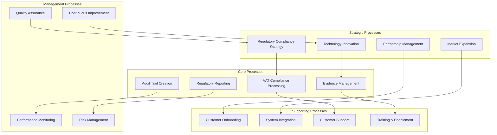

# TaxChain Business Process Models

## Process Architecture Overview



## Core Process Models (BPMN)

### 1. VAT Compliance Processing - Level 0

```mermaid
graph LR
    subgraph "Swimlanes"
        subgraph "Enterprise User"
            A[Transaction Initiated<br/>in ERP System]
            B[Review Compliance<br/>Status & Certificate]
        end
        
        subgraph "TaxChain Platform"
            C[Receive Transaction<br/>Data via API]
            D[Validate Business<br/>Rules & Requirements]
            E[Create Blockchain<br/>Evidence Record]
            F[Generate Compliance<br/>Certificate]
        end
        
        subgraph "Tax Authority"
            G[Receive Real-time<br/>Notification]
            H[Access Audit Trail<br/>for