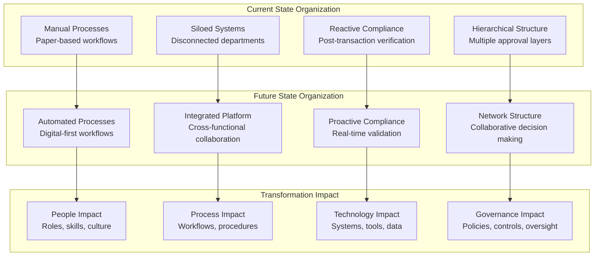
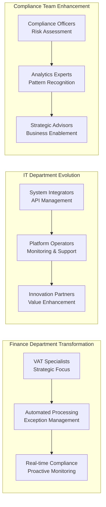
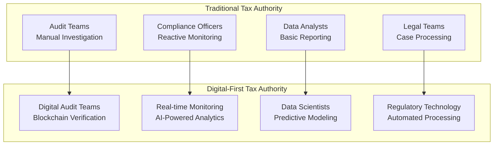
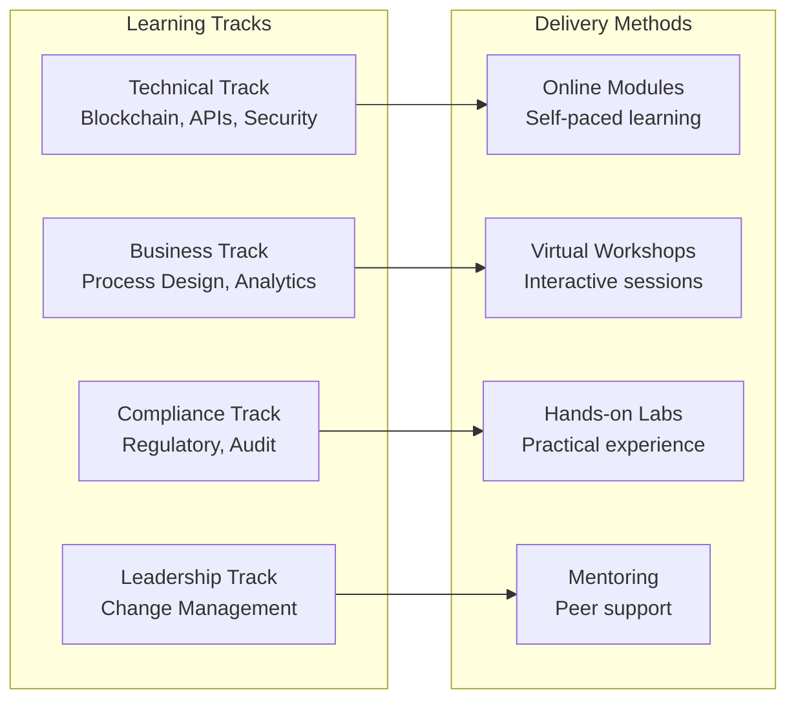

# TaxChain Organization Impact Assessment

## Executive Summary

The TaxChain implementation will fundamentally transform organizational structures, requiring new roles, modified responsibilities, and comprehensive change management across all stakeholders. This assessment identifies impacts on 3 primary organizational layers: internal TaxChain operations, customer enterprises, and regulatory bodies.

## Organizational Change Overview

## Impact Analysis by Organization Type

### 1. TaxChain Internal Organization

#### Current Structure Analysis
**Traditional Software Company Structure:**
- Development teams working in isolation
- Manual customer onboarding processes
- Reactive customer support model
- Limited regulatory expertise

#### Target Operating Model

```mermaid
graph TB
    subgraph "Executive Layer"
        CEO[CEO/Founder]
        CTO[Chief Technology Officer]
        CPO[Chief Product Officer]  
        CCO[Chief Compliance Officer]
    end
    
    subgraph "Product & Engineering"
        PA[Product Architecture Team<br/>3 Product Architects]
        BC[Blockchain Engineering<br/>8 Blockchain Engineers]
        API[API & Integration<br/>6 Integration Engineers]
        UI[User Experience<br/>4 UX/UI Engineers]
        QA[Quality Assurance<br/>5 QA Engineers]
    end
    
    subgraph "Compliance & Regulatory"
        REG[Regulatory Affairs<br/>4 Regulatory Specialists]
        COMP[Compliance Engineering<br/>3 Compliance Engineers]
        LEGAL[Legal Affairs<br/>2 Legal Advisors]
        AUDIT[Internal Audit<br/>2 Audit Specialists]
    end
    
    subgraph "Customer Success"
        CS[Customer Success<br/>6 Success Managers]
        IMPL[Implementation<br/>8 Implementation Specialists]
        SUP[Technical Support<br/>12 Support Engineers]
        TRAIN[Training Services<br/>4 Training Specialists]
    end
    
    subgraph "Operations"
        DEVOPS[Platform Operations<br/>6 DevOps Engineers]
        SEC[Security Operations<br/>4 Security Engineers]
        DATA[Data Operations<br/>3 Data Engineers]
        MON[Monitoring & Analytics<br/>2 Site Reliability Engineers]
    end
    
    CEO --> CTO
    CEO --> CPO
    CEO --> CCO
    
    CTO --> BC
    CTO --> DEVOPS
    CPO --> PA
    CPO --> CS
    CCO --> REG
    CCO --> COMP
```

#### Organizational Transformation Requirements

**New Roles Created (25 positions):**
| Role | Count | Salary Range | Annual Cost | Key Responsibilities |
|------|-------|--------------|-------------|---------------------|
| Chief Compliance Officer | 1 | €180K-220K | €200K | Regulatory strategy, compliance oversight |
| Blockchain Architects | 2 | €120K-150K | €270K | Platform architecture, technical strategy |
| Regulatory Specialists | 4 | €80K-100K | €360K | VAT law interpretation, regulatory monitoring |
| Implementation Specialists | 8 | €70K-90K | €640K | Customer onboarding, system integration |
| Customer Success Managers | 6 | €60K-80K | €420K | Account management, value realization |
| Compliance Engineers | 3 | €90K-110K | €300K | Compliance automation, rule engines |
| Security Engineers | 4 | €100K-120K | €440K | Blockchain security, enterprise security |
| **Total New Roles** | **28** | | **€2.63M** | |

**Role Transformations (15 existing positions):**
| Current Role | New Role | Change Type | Training Required |
|--------------|----------|-------------|-------------------|
| Software Engineers | Blockchain Engineers | Skill upgrade | 120 hours blockchain development |
| Business Analysts | Product Managers | Scope expansion | 80 hours product management |
| QA Testers | Automation Engineers | Process change | 100 hours test automation |
| Support Staff | Customer Success | Role evolution | 60 hours customer success methodology |
| IT Administrators | DevOps Engineers | Technology shift | 140 hours cloud/containers |

### 2. Enterprise Customer Organizations

#### Current State Pain Points
- **Finance Departments**: Manual VAT processing, error-prone calculations
- **IT Departments**: Multiple integration points, maintenance overhead
- **Compliance Teams**: Manual audit preparation, regulatory monitoring
- **Operations Teams**: Process bottlenecks, manual interventions

#### Future State Operating Model

#### Impact by Department

**Finance Department (Large Enterprise - 500+ employees):**
| Impact Area | Current State | Future State | Change Management |
|-------------|---------------|--------------|-------------------|
| **Staffing** | 12 VAT specialists | 8 VAT specialists | 4 roles eliminated, 8 upskilled |
| **Skills** | Manual processing | Digital analytics | 40 hours training per person |
| **Processes** | 40 hours/month manual work | 10 hours/month oversight | Process reengineering required |
| **Performance** | 23% error rate | <1% error rate | KPI transformation needed |

**IT Department Impact:**
| Current Responsibilities | Future Responsibilities | Skills Development |
|-------------------------|------------------------|-------------------|
| ERP maintenance | API integration management | RESTful API design (20 hours) |
| Manual report generation | Dashboard configuration | Business intelligence tools (30 hours) |
| System troubleshooting | Platform monitoring | Cloud operations (40 hours) |
| Data backup procedures | Blockchain node operations | Distributed systems (60 hours) |

### 3. Tax Authority Organizations

#### Regulatory Body Transformation

**Current State Challenges:**
- Manual audit processes consuming 60% of staff time
- Limited cross-border collaboration capabilities
- Reactive fraud detection (18-month average discovery time)
- Paper-based evidence management

**Target Organizational Structure:**

#### Transformation Requirements for Tax Authorities

**Role Evolution Analysis:**
| Traditional Role | Digital Role | Skill Gap | Training Program |
|------------------|--------------|-----------|------------------|
| **Manual Auditor** | **Digital Verification Specialist** | Blockchain literacy, cryptographic verification | 80-hour certification program |
| **Compliance Officer** | **Real-time Risk Analyst** | Data analytics, pattern recognition | 60-hour analytics training |
| **Data Processor** | **Data Scientist** | Machine learning, predictive modeling | 120-hour data science bootcamp |
| **Legal Reviewer** | **RegTech Specialist** | Digital law, smart contracts | 40-hour legal technology course |

## Change Management Strategy

### Phase 1: Foundation (Months 1-6)

#### Leadership Alignment
**Objective**: Secure executive commitment and establish change governance
**Activities**:
- Executive workshops on digital transformation
- Change champion network establishment
- Communication strategy development
- Success metrics definition

**Investment**: €150K
**Success Metrics**: 95% leadership engagement score

#### Skills Assessment
**Objective**: Identify current capabilities and skill gaps
**Activities**:
- Organization-wide skills inventory
- Role impact analysis
- Learning needs assessment
- Career path planning

**Tools Used**:
- Skills matrix templates
- Assessment surveys
- 1:1 interview guides
- Competency frameworks

### Phase 2: Capability Building (Months 7-12)

#### Training & Development Program

**Training Investment Analysis:**
| Program | Participants | Hours per Person | Cost per Hour | Total Investment |
|---------|--------------|------------------|---------------|------------------|
| Technical Skills | 150 | 80 | €75 | €900K |
| Business Process | 200 | 40 | €60 | €480K |
| Compliance & Regulatory | 75 | 60 | €80 | €360K |
| Leadership Development | 25 | 30 | €100 | €75K |
| **Total Training** | **450** | **210** | **€72** | **€1.815M** |

### Phase 3: Transformation (Months 13-18)

#### Organizational Restructuring
**Objective**: Implement new organizational structures and processes
**Activities**:
- Role transitions and assignments
- Process implementation
- System go-live support
- Performance monitoring

**Change Support Structure:**
- 2 Change Management Specialists (€120K each)
- 1 Training Coordinator (€80K)
- 4 Process Champions (€60K each)
- **Total Support Cost**: €560K

## Risk Assessment & Mitigation

### High-Risk Areas

#### 1. Skills Gap Risk
**Risk Level**: High
**Impact**: Delayed implementation, poor adoption, operational failures
**Probability**: 70%

**Mitigation Strategies**:
- Early skills assessment and gap analysis
- Comprehensive training programs
- External hiring for critical gaps
- Knowledge management systems
- Mentoring and coaching programs

#### 2. Resistance to Change
**Risk Level**: Medium-High  
**Impact**: Poor adoption, process circumvention, cultural friction
**Probability**: 60%

**Mitigation Strategies**:
- Stakeholder engagement from day one
- Clear communication of benefits
- Change champion networks
- Incentive alignment
- Success story sharing

#### 3. Role Displacement Anxiety
**Risk Level**: Medium
**Impact**: Employee turnover, morale issues, productivity loss
**Probability**: 50%

**Mitigation Strategies**:
- Transparent communication about job impacts
- Retraining and upskilling opportunities
- Career transition support
- Retention bonuses for key personnel
- Gradual transition timelines

### Medium-Risk Areas

#### 4. Process Integration Complexity
**Risk Level**: Medium
**Impact**: Operational disruption, efficiency loss, customer impact
**Probability**: 45%

**Mitigation Strategies**:
- Phased implementation approach
- Parallel process running
- Extensive testing and validation
- Rollback procedures
- Business continuity planning

## Success Metrics & KPIs

### Organizational Health Metrics

| Category | Metric | Current Baseline | Target | Timeline |
|----------|---------|------------------|---------|----------|
| **Employee Engagement** | Engagement Score | 3.2/5.0 | 4.2/5.0 | 18 months |
| **Skills Readiness** | Digital Skills Score | 2.8/5.0 | 4.0/5.0 | 12 months |
| **Change Adoption** | Process Adherence Rate | 65% | 90% | 12 months |
| **Productivity** | Transactions per FTE | 850/month | 2,100/month | 18 months |
| **Quality** | Process Error Rate | 5.2% | <1.0% | 12 months |
| **Customer Impact** | Customer Satisfaction | 3.1/5.0 | 4.5/5.0 | 18 months |

### Financial Impact Analysis

#### Cost-Benefit Analysis (18 months)
**Total Investment**: €4.93M
- New roles: €2.63M
- Training: €1.815M  
- Change support: €0.56M
- Technology: €0.925M (infrastructure, tools)

**Expected Benefits**: €12.8M
- Productivity gains: €7.2M
- Error reduction: €2.1M
- Process automation: €3.5M

**Net ROI**: 159% over 18 months

#### Payback Analysis
- **Break-even point**: Month 11
- **5-year NPV**: €24.3M (10% discount rate)
- **Internal Rate of Return**: 42%

## Implementation Roadmap

### Pre-Implementation (Months 1-3)
- Organization assessment completion
- Change strategy finalization
- Training program development
- Communication plan execution
- Success metrics baseline establishment

### Implementation Phase 1 (Months 4-9)
- Core team training completion
- Process pilot programs
- System integration testing
- Change champion deployment
- Early adopter programs

### Implementation Phase 2 (Months 10-15)
- Full-scale deployment
- Organization-wide training
- Process optimization
- Performance monitoring
- Issue resolution

### Post-Implementation (Months 16-18)
- Success measurement
- Continuous improvement
- Knowledge transfer
- Capability maturation
- Future planning

---

**Change Management Owner**: Chief People Officer  
**Process Excellence Owner**: VP Operations  
**Training Program Owner**: Learning & Development Team  
**Last Updated**: [Current Date]  
**Next Review**: Monthly change management review