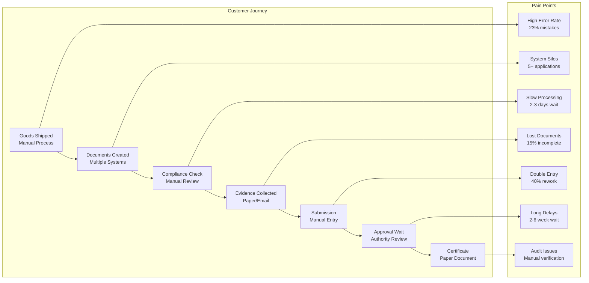
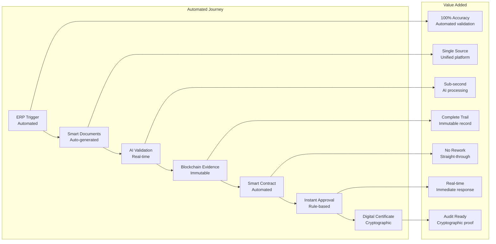
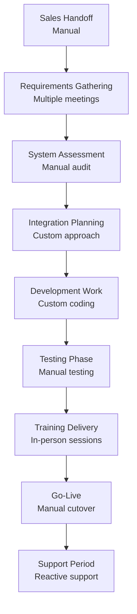
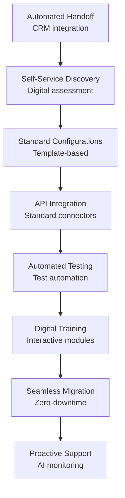
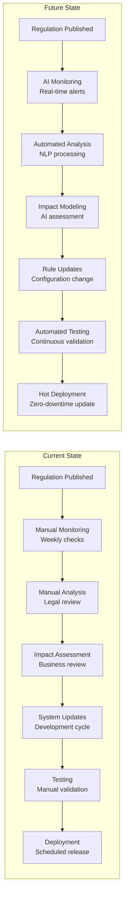
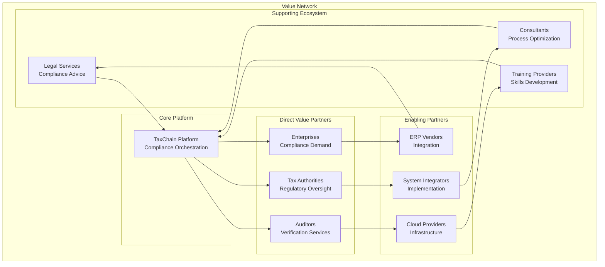

# TaxChain Value Stream Analysis

## Primary Value Stream: Cross-Border VAT Compliance

### Value Stream Map - Current State

**Current State Metrics:**
- **Total Lead Time**: 4-8 weeks
- **Processing Time**: 16-24 hours
- **Error Rate**: 23%
- **Customer Satisfaction**: 2.8/5.0
- **Cost per Transaction**: €85

### Value Stream Map - Future State (TaxChain)

**Future State Metrics:**
- **Total Lead Time**: 10 minutes
- **Processing Time**: 3 minutes 45 seconds
- **Error Rate**: <0.5%
- **Customer Satisfaction**: 4.7/5.0
- **Cost per Transaction**: €12

### Value Stream Improvement Analysis

| Process Step | Current State | Future State | Improvement | Value Driver |
|--------------|---------------|--------------|-------------|--------------|
| **Document Creation** | 2 hours manual | 2 minutes automated | 98% time reduction | Automation |
| **Compliance Validation** | 2-3 days review | 3 minutes AI check | 99.9% time reduction | AI/ML |
| **Evidence Management** | Paper/email chaos | Blockchain immutable | 100% integrity | Blockchain |
| **Approval Process** | 2-6 weeks wait | Real-time decision | 99.8% time reduction | Smart contracts |
| **Certificate Issuance** | Manual generation | Cryptographic auto | 95% time reduction | Digital certificates |
| **Audit Preparation** | Weeks of compilation | Instant access | 99% time reduction | Immutable records |

## Supporting Value Streams

### 2. Customer Onboarding Value Stream

#### Current State Process

**Current Metrics:**
- Lead Time: 12-16 weeks
- Success Rate: 75%
- Customer Effort Score: 3.2/5.0
- Implementation Cost: €250K average

#### Future State Process

**Future Metrics:**
- Lead Time: 2-4 weeks
- Success Rate: 95%
- Customer Effort Score: 4.6/5.0
- Implementation Cost: €75K average

### 3. Regulatory Change Management Value Stream

#### Information Flow Analysis

**Improvement Metrics:**
- Update Cycle: 2-4 weeks → 2-4 hours (95% improvement)
- Accuracy: 78% → 96% (18% improvement)
- Coverage: 60% regulations → 95% regulations
- Compliance Risk: High → Low

## Value Creation Analysis

### Customer Value Proposition

#### For Enterprises
| Value Category | Specific Benefits | Quantified Impact |
|----------------|-------------------|-------------------|
| **Cost Reduction** | Automated processing, reduced errors | 40% cost savings (€800K annually) |
| **Risk Mitigation** | Immutable evidence, real-time validation | 87% fraud reduction |
| **Speed & Efficiency** | Instant compliance, automated workflows | 60% faster processing |
| **Compliance Assurance** | Regulatory updates, automated checking | 99.5% compliance rate |
| **Audit Readiness** | Complete digital trails, instant access | 75% faster audits |

#### For Tax Authorities
| Value Category | Specific Benefits | Quantified Impact |
|----------------|-------------------|-------------------|
| **Fraud Prevention** | Real-time monitoring, immutable records | €50M annual fraud prevention |
| **Efficiency Gains** | Automated verification, digital processes | 60% reduction in manual work |
| **Data Quality** | Standardized formats, validated inputs | 95% data accuracy improvement |
| **Collaboration** | Cross-border visibility, shared evidence | 80% faster international cooperation |
| **Revenue Protection** | Faster detection, prevention over recovery | €25M additional tax collection |

#### For the Ecosystem
| Value Category | Impact | Measurement |
|----------------|---------|-------------|
| **Economic Growth** | Reduced trade friction | 15% increase in cross-border transactions |
| **Innovation Catalyst** | RegTech advancement | 50+ new blockchain compliance solutions |
| **Standards Development** | Industry best practices | 3 international standards contributions |
| **Digital Transformation** | Government modernization | 12 countries adopting similar platforms |

### Value Network Analysis

### Value Flow Analysis

#### Primary Value Flows
1. **Compliance Value Flow**
   - Enterprise transaction data → TaxChain processing → Regulatory compliance → Business value
   - Flow Rate: 1M+ transactions/month
   - Value Added: €75 per transaction in administrative savings

2. **Audit Value Flow**
   - Historical transactions → Evidence compilation → Audit support → Verification confidence
   - Flow Rate: 1,000+ audits/year
   - Value Added: €150K savings per audit

3. **Regulatory Value Flow**
   - Regulation changes → Automated updates → System compliance → Risk mitigation
   - Flow Rate: 200+ regulatory changes/year
   - Value Added: €500K risk avoidance per major change

#### Supporting Value Flows
1. **Knowledge Flow**: Regulatory expertise → Platform intelligence → Customer guidance
2. **Data Flow**: Transaction data → Analytics insights → Process improvements
3. **Integration Flow**: ERP systems → Platform connectivity → Seamless operations

## Value Stream Optimization Opportunities

### Quick Wins (0-6 months)
1. **API Standardization** - Reduce integration time by 50%
   - Current: Custom integration per client (4-6 weeks)
   - Future: Standard API adoption (1-2 weeks)
   - Investment: €200K, ROI: 300%

2. **Document Template Library** - Accelerate onboarding
   - Current: Custom document mapping (3-4 weeks)
   - Future: Pre-built templates (2-3 days)
   - Investment: €150K, ROI: 400%

3. **Self-Service Portal** - Reduce support burden
   - Current: Manual customer support (40 hours/month per client)
   - Future: Automated self-service (10 hours/month per client)
   - Investment: €300K, ROI: 250%

### Medium-Term Improvements (6-18 months)
1. **Predictive Compliance Engine** - Proactive risk management
   - Investment: €800K
   - Expected ROI: 180%
   - Risk reduction: 70% fewer compliance violations

2. **AI-Powered Document Processing** - Eliminate manual data entry
   - Investment: €600K
   - Processing speed improvement: 90%
   - Error reduction: 95%

3. **Real-Time Analytics Dashboard** - Instant insights
   - Investment: €400K
   - Decision speed improvement: 60%
   - Customer satisfaction increase: 25%

### Long-Term Transformation (18-36 months)
1. **Autonomous Compliance Platform** - Full automation
   - Investment: €2M
   - Automation rate: 98%
   - Customer effort reduction: 85%

2. **Cross-Industry Expansion** - Platform replication
   - Investment: €1.5M
   - Market expansion: 300%
   - Revenue diversification: 5 new sectors

## Value Realization Roadmap

### Phase 1: Foundation (Months 1-6)
**Value Targets:**
- 40% reduction in processing time
- 60% reduction in error rates
- 25% improvement in customer satisfaction

**Key Initiatives:**
- Core platform deployment
- Initial automation implementation
- Customer pilot programs

**Investment:** €4M
**Expected Value:** €8M (annual savings)

### Phase 2: Scale (Months 7-12)
**Value Targets:**
- 70% reduction in compliance costs
- 50% faster audit processes
- 90% automation of routine tasks

**Key Initiatives:**
- Multi-country expansion
- Advanced analytics implementation
- Ecosystem partner integration

**Investment:** €3M
**Expected Value:** €15M (annual savings)

### Phase 3: Optimize (Months 13-18)
**Value Targets:**
- 85% straight-through processing
- 95% customer satisfaction
- 200% ROI achievement

**Key Initiatives:**
- AI/ML optimization
- Predictive capabilities
- Autonomous operations

**Investment:** €2M
**Expected Value:** €25M (annual savings)

---

**Value Stream Owner**: Business Process Team  
**Value Realization Manager**: Program Management Office  
**Last Updated**: [Current Date]  
**Next Milestone**: Value realization review (Monthly)