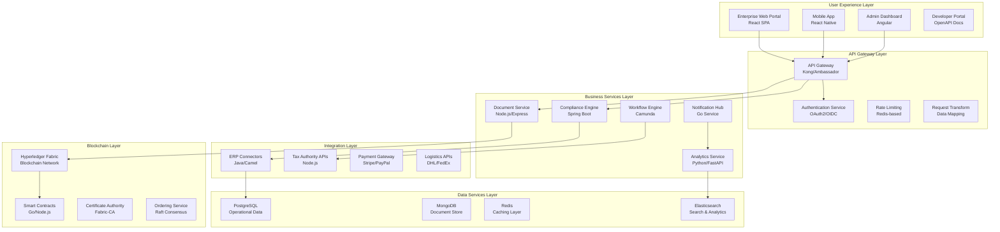
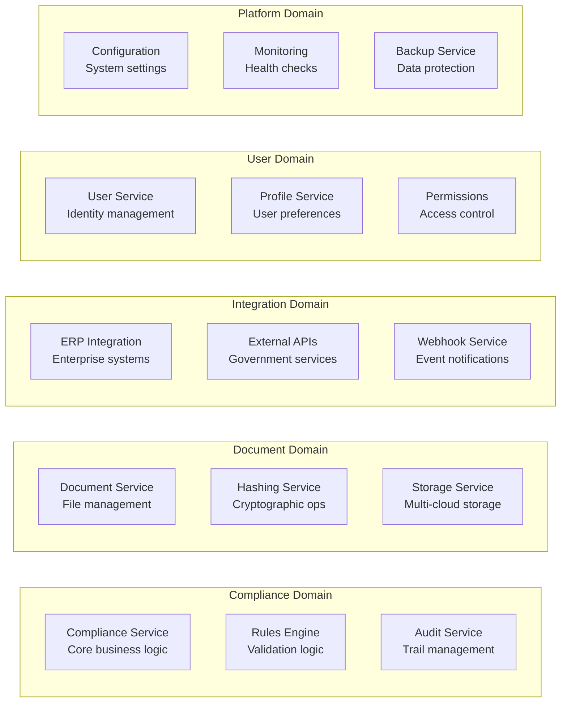
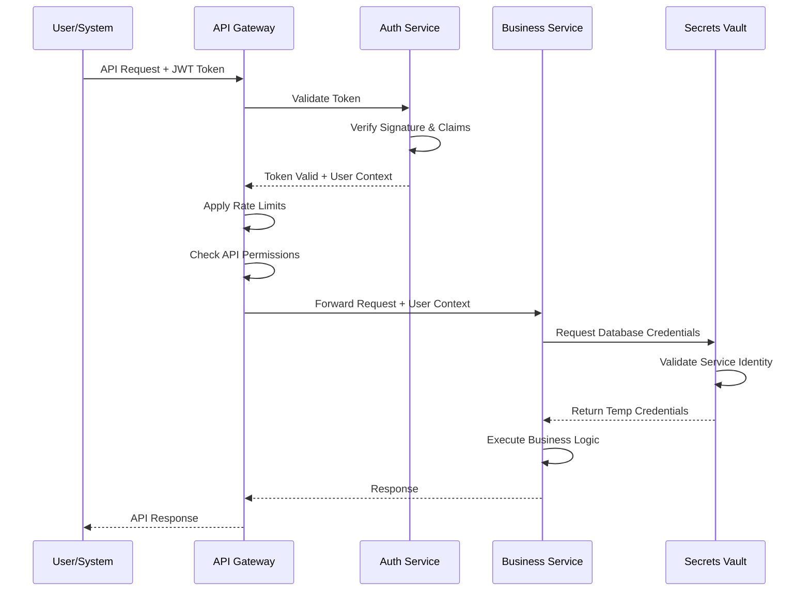

# TaxChain Application Architecture

## Application Portfolio Overview



## Microservices Architecture Design

### Service Decomposition Strategy

#### Domain-Driven Design Boundaries


### Core Application Services

#### 1. Compliance Engine Service

**Technology Stack:** Java 17, Spring Boot 3.x, Maven
**Database:** PostgreSQL with JPA/Hibernate
**Messaging:** Apache Kafka for event streaming

```yaml
service_specification:
  name: "compliance-engine"
  version: "2.1.0"
  description: "Core VAT compliance processing engine"
  
  architecture:
    pattern: "Hexagonal Architecture"
    layers:
      - "Rest Controllers (Adapters)"
      - "Application Services (Use Cases)"
      - "Domain Model (Business Logic)"
      - "Infrastructure (Repositories)"
  
  api_endpoints:
    - endpoint: "POST /v2/compliance/validate"
      description: "Validate transaction for compliance"
      input: "TransactionRequest"
      output: "ComplianceResult"
      sla: "< 500ms"
      
    - endpoint: "GET /v2/compliance/{id}/status"
      description: "Get compliance status"
      input: "ComplianceId"
      output: "ComplianceStatus"
      sla: "< 100ms"
      
    - endpoint: "POST /v2/compliance/{id}/approve"
      description: "Manual compliance approval"
      input: "ApprovalRequest"
      output: "ApprovalResult"
      sla: "< 200ms"
  
  business_capabilities:
    - "VAT rate calculation"
    - "Jurisdiction determination" 
    - "Compliance rule validation"
    - "Risk scoring algorithm"
    - "Exception handling workflow"
    
  performance_requirements:
    throughput: "1000 requests/second"
    availability: "99.9%"
    response_time_p95: "500ms"
    error_rate: "< 0.1%"
```

**Service Implementation Pattern:**
```java
@RestController
@RequestMapping("/v2/compliance")
public class ComplianceController {
    
    private final ComplianceApplicationService complianceService;
    
    @PostMapping("/validate")
    public ResponseEntity<ComplianceResult> validateTransaction(
            @Valid @RequestBody TransactionRequest request) {
        
        try {
            ComplianceResult result = complianceService.validateCompliance(request);
            return ResponseEntity.ok(result);
        } catch (ComplianceValidationException e) {
            return ResponseEntity.badRequest()
                .body(ComplianceResult.error(e.getMessage()));
        }
    }
}

@Service
@Transactional
public class ComplianceApplicationService {
    
    private final TransactionRepository transactionRepository;
    private final ComplianceRuleEngine ruleEngine;
    private final BlockchainService blockchainService;
    private final EventPublisher eventPublisher;
    
    public ComplianceResult validateCompliance(TransactionRequest request) {
        // 1. Create domain entity
        Transaction transaction = Transaction.fromRequest(request);
        
        // 2. Apply business rules
        ComplianceStatus status = ruleEngine.evaluate(transaction);
        
        // 3. Create compliance record
        ComplianceRecord record = new ComplianceRecord(transaction, status);
        
        // 4. Persist to database
        transactionRepository.save(transaction);
        
        // 5. Anchor to blockchain (async)
        blockchainService.anchorEvidence(record);
        
        // 6. Publish domain event
        eventPublisher.publish(new ComplianceValidatedEvent(record));
        
        return ComplianceResult.from(record);
    }
}
```

#### 2. Document Management Service

**Technology Stack:** Node.js 18, Express.js, TypeScript
**Storage:** MongoDB for metadata, S3 for files
**Security:** AES-256 encryption, digital signatures

```typescript
interface DocumentService {
  uploadDocument(file: FileUpload, metadata: DocumentMetadata): Promise<DocumentRecord>;
  getDocument(documentId: string): Promise<DocumentRecord>;
  generateHash(documentId: string): Promise<DocumentHash>;
  verifyIntegrity(documentId: string): Promise<IntegrityResult>;
}

class DocumentServiceImpl implements DocumentService {
  constructor(
    private storage: StorageProvider,
    private hashService: HashingService,
    private encryptionService: EncryptionService,
    private signatureService: DigitalSignatureService
  ) {}
  
  async uploadDocument(
    file: FileUpload, 
    metadata: DocumentMetadata
  ): Promise<DocumentRecord> {
    
    // 1. Validate file type and size
    this.validateFile(file);
    
    // 2. Generate document hash
    const hash = await this.hashService.generateSHA256(file.buffer);
    
    // 3. Encrypt file content
    const encryptedContent = await this.encryptionService.encrypt(file.buffer);
    
    // 4. Store encrypted file
    const storageKey = await this.storage.store(encryptedContent);
    
    // 5. Create document record
    const document = new DocumentRecord({
      id: generateUUID(),
      filename: file.originalname,
      contentType: file.mimetype,
      size: file.size,
      hash: hash,
      storageKey: storageKey,
      metadata: metadata,
      uploadedAt: new Date(),
      encryptionKeyId: encryptedContent.keyId
    });
    
    // 6. Generate digital signature
    const signature = await this.signatureService.sign(hash);
    document.digitalSignature = signature;
    
    // 7. Store document metadata
    await this.documentRepository.save(document);
    
    // 8. Publish document uploaded event
    await this.eventBus.publish(new DocumentUploadedEvent(document));
    
    return document;
  }
  
  async verifyIntegrity(documentId: string): Promise<IntegrityResult> {
    // 1. Retrieve document record
    const document = await this.documentRepository.findById(documentId);
    if (!document) throw new DocumentNotFoundError();
    
    // 2. Retrieve file content
    const encryptedContent = await this.storage.retrieve(document.storageKey);
    const content = await this.encryptionService.decrypt(encryptedContent);
    
    // 3. Recalculate hash
    const currentHash = await this.hashService.generateSHA256(content);
    
    // 4. Compare hashes
    const hashMatch = currentHash === document.hash;
    
    // 5. Verify digital signature
    const signatureValid = await this.signatureService.verify(
      document.hash, 
      document.digitalSignature
    );
    
    return {
      documentId,
      hashIntegrity: hashMatch,
      signatureValidity: signatureValid,
      overallIntegrity: hashMatch && signatureValid,
      verifiedAt: new Date()
    };
  }
}
```

#### 3. Blockchain Integration Service

**Technology Stack:** Go 1.21, Hyperledger Fabric SDK
**Consensus:** Raft ordering service
**Smart Contracts:** Go chaincode for compliance logic

```go
package blockchain

import (
    "context"
    "encoding/json"
    "fmt"
    
    "github.com/hyperledger/fabric-sdk-go/pkg/gateway"
)

type BlockchainService interface {
    AnchorEvidence(ctx context.Context, evidence *EvidenceRecord) (*AnchorResult, error)
    QueryEvidence(ctx context.Context, evidenceID string) (*EvidenceRecord, error)
    VerifyIntegrity(ctx context.Context, evidenceID string) (*IntegrityProof, error)
}

type blockchainService struct {
    gateway  *gateway.Gateway
    contract *gateway.Contract
}

func NewBlockchainService(configPath string) (BlockchainService, error) {
    gw, err := gateway.Connect(
        gateway.WithConfig(config.FromFile(configPath)),
        gateway.WithIdentity(wallet, "Admin"),
    )
    if err != nil {
        return nil, fmt.Errorf("failed to connect to gateway: %w", err)
    }
    
    contract := gw.GetNetwork("compliance-channel").GetContract("taxchain-chaincode")
    
    return &blockchainService{
        gateway:  gw,
        contract: contract,
    }, nil
}

func (bs *blockchainService) AnchorEvidence(
    ctx context.Context, 
    evidence *EvidenceRecord,
) (*AnchorResult, error) {
    
    // 1. Prepare chaincode arguments
    evidenceJSON, err := json.Marshal(evidence)
    if err != nil {
        return nil, fmt.Errorf("failed to marshal evidence: %w", err)
    }
    
    // 2. Submit transaction to blockchain
    txn, err := bs.contract.SubmitTransaction(
        "AnchorEvidence",
        evidence.ID,
        string(evidenceJSON),
        evidence.ComplianceID,
        evidence.Timestamp.Format(time.RFC3339),
    )
    if err != nil {
        return nil, fmt.Errorf("failed to submit transaction: %w", err)
    }
    
    // 3. Parse transaction response
    var result AnchorResult
    if err := json.Unmarshal(txn, &result); err != nil {
        return nil, fmt.Errorf("failed to unmarshal result: %w", err)
    }
    
    return &result, nil
}

func (bs *blockchainService) QueryEvidence(
    ctx context.Context, 
    evidenceID string,
) (*EvidenceRecord, error) {
    
    // Query blockchain for evidence record
    result, err := bs.contract.EvaluateTransaction("QueryEvidence", evidenceID)
    if err != nil {
        return nil, fmt.Errorf("failed to query evidence: %w", err)
    }
    
    var evidence EvidenceRecord
    if err := json.Unmarshal(result, &evidence); err != nil {
        return nil, fmt.Errorf("failed to unmarshal evidence: %w", err)
    }
    
    return &evidence, nil
}

func (bs *blockchainService) VerifyIntegrity(
    ctx context.Context, 
    evidenceID string,
) (*IntegrityProof, error) {
    
    // 1. Query evidence from blockchain
    evidence, err := bs.QueryEvidence(ctx, evidenceID)
    if err != nil {
        return nil, err
    }
    
    // 2. Get transaction history for provenance
    history, err := bs.contract.EvaluateTransaction("GetEvidenceHistory", evidenceID)
    if err != nil {
        return nil, fmt.Errorf("failed to get evidence history: %w", err)
    }
    
    // 3. Build integrity proof
    proof := &IntegrityProof{
        EvidenceID:      evidenceID,
        BlockchainHash:  evidence.BlockchainHash,
        TransactionID:   evidence.TransactionID,
        Timestamp:       evidence.Timestamp,
        ImmutabilityProof: string(history),
        Verified:        true,
    }
    
    return proof, nil
}

// Smart Contract (Chaincode) Logic
type TaxChainContract struct {
    contractapi.Contract
}

func (tc *TaxChainContract) AnchorEvidence(
    ctx contractapi.TransactionContextInterface,
    evidenceID string,
    evidenceData string,
    complianceID string,
    timestamp string,
) (*AnchorResult, error) {
    
    // 1. Validate input parameters
    if evidenceID == "" || evidenceData == "" {
        return nil, fmt.Errorf("evidence ID and data are required")
    }
    
    // 2. Check if evidence already exists
    existing, err := ctx.GetStub().GetState(evidenceID)
    if err != nil {
        return nil, fmt.Errorf("failed to read evidence: %w", err)
    }
    if existing != nil {
        return nil, fmt.Errorf("evidence %s already exists", evidenceID)
    }
    
    // 3. Create evidence record
    evidence := EvidenceRecord{
        ID:           evidenceID,
        ComplianceID: complianceID,
        Data:         evidenceData,
        Timestamp:    timestamp,
        CreatedBy:    ctx.GetClientIdentity().GetID(),
        TxID:         ctx.GetStub().GetTxID(),
    }
    
    // 4. Store evidence on ledger
    evidenceJSON, _ := json.Marshal(evidence)
    err = ctx.GetStub().PutState(evidenceID, evidenceJSON)
    if err != nil {
        return nil, fmt.Errorf("failed to store evidence: %w", err)
    }
    
    // 5. Emit event for external listeners
    ctx.GetStub().SetEvent("EvidenceAnchored", evidenceJSON)
    
    return &AnchorResult{
        EvidenceID:    evidenceID,
        TransactionID: ctx.GetStub().GetTxID(),
        BlockNumber:   ctx.GetStub().GetTxTimestamp().Seconds,
        Success:       true,
    }, nil
}
```

## Integration Architecture Patterns

### API Integration Strategy

#### Enterprise System Connectors

**SAP Integration Pattern:**
```xml
<!-- SAP RFC/BAPI Integration via Spring Integration -->
<int:channel id="sapInputChannel"/>
<int:channel id="sapOutputChannel"/>

<int-sap:rfc-outbound-gateway 
    id="sapGateway"
    request-channel="sapInputChannel"
    reply-channel="sapOutputChannel"
    destination-name="SAP_SYSTEM"
    function-name="BAPI_VAT_TRANSACTION_GET"/>

<int:transformer 
    input-channel="sapOutputChannel"
    output-channel="complianceChannel"
    expression="T(com.taxchain.sap.SAPTransformer).toComplianceRequest(payload)"/>
```

**Oracle ERP Integration:**
```yaml
oracle_integration:
  connection:
    host: "oracle-erp.company.com"
    port: 1521
    service_name: "ERPDB"
    username: "${ORACLE_USER}"
    password: "${ORACLE_PASSWORD}"
    
  queries:
    extract_transactions: |
      SELECT 
        transaction_id,
        supplier_vat,
        customer_vat,
        amount,
        currency,
        transaction_date,
        transaction_type
      FROM ar_transactions 
      WHERE created_date >= ?
        AND vat_applicable = 'Y'
        AND processed_flag = 'N'
        
  batch_processing:
    schedule: "0 */15 * * * ?" # Every 15 minutes
    batch_size: 1000
    retry_attempts: 3
    error_handling: "skip_and_log"
```

### Event-Driven Integration

#### Event Sourcing Implementation
```typescript
// Event Store Pattern
abstract class DomainEvent {
  public readonly aggregateId: string;
  public readonly eventType: string;
  public readonly timestamp: Date;
  public readonly version: number;
  
  constructor(aggregateId: string, eventType: string) {
    this.aggregateId = aggregateId;
    this.eventType = eventType;
    this.timestamp = new Date();
    this.version = 1;
  }
}

class TransactionCreatedEvent extends DomainEvent {
  constructor(
    aggregateId: string,
    public readonly transactionData: TransactionData
  ) {
    super(aggregateId, 'TransactionCreated');
  }
}

class ComplianceValidatedEvent extends DomainEvent {
  constructor(
    aggregateId: string,
    public readonly complianceResult: ComplianceResult
  ) {
    super(aggregateId, 'ComplianceValidated');
  }
}

// Event Store Interface
interface EventStore {
  saveEvents(aggregateId: string, events: DomainEvent[]): Promise<void>;
  getEvents(aggregateId: string): Promise<DomainEvent[]>;
  getEventsByType(eventType: string): Promise<DomainEvent[]>;
}

// Event Sourced Aggregate
class ComplianceAggregate {
  private events: DomainEvent[] = [];
  
  constructor(
    public readonly id: string,
    private eventStore: EventStore
  ) {}
  
  async loadFromHistory(): Promise<void> {
    const events = await this.eventStore.getEvents(this.id);
    for (const event of events) {
      this.apply(event);
    }
  }
  
  processTransaction(transactionData: TransactionData): void {
    // Business logic
    const event = new TransactionCreatedEvent(this.id, transactionData);
    this.applyAndRecord(event);
  }
  
  validateCompliance(rules: ComplianceRule[]): void {
    // Compliance validation logic
    const result = this.executeValidation(rules);
    const event = new ComplianceValidatedEvent(this.id, result);
    this.applyAndRecord(event);
  }
  
  private applyAndRecord(event: DomainEvent): void {
    this.apply(event);
    this.events.push(event);
  }
  
  async commit(): Promise<void> {
    if (this.events.length > 0) {
      await this.eventStore.saveEvents(this.id, this.events);
      this.events = [];
    }
  }
}
```

## Performance & Scalability Design

### Caching Strategy

#### Multi-Level Caching Architecture
```yaml
caching_layers:
  level_1_application:
    type: "In-Memory"
    implementation: "Caffeine"
    ttl: "5 minutes"
    max_size: "10000 entries"
    use_cases: ["compliance rules", "user sessions"]
    
  level_2_distributed:
    type: "Distributed Cache"
    implementation: "Redis Cluster"
    ttl: "1 hour"
    max_memory: "2GB per node"
    use_cases: ["API responses", "computed results"]
    
  level_3_cdn:
    type: "Content Delivery Network"
    implementation: "CloudFlare"
    ttl: "24 hours"
    use_cases: ["static assets", "documentation"]
    
cache_patterns:
  cache_aside:
    description: "Application manages cache explicitly"
    use_case: "User profile data"
    
  write_through:
    description: "Write to cache and database simultaneously"
    use_case: "Configuration updates"
    
  write_behind:
    description: "Write to cache immediately, database later"
    use_case: "Analytics events"
```

#### Cache Implementation Example
```java
@Service
@CacheConfig(cacheNames = "compliance-rules")
public class ComplianceRuleService {
    
    @Cacheable(key = "#jurisdiction + ':' + #transactionType")
    public List<ComplianceRule> getRules(String jurisdiction, String transactionType) {
        return ruleRepository.findByJurisdictionAndType(jurisdiction, transactionType);
    }
    
    @CacheEvict(key = "#rule.jurisdiction + ':' + #rule.transactionType")
    public void updateRule(ComplianceRule rule) {
        ruleRepository.save(rule);
    }
    
    @Caching(evict = {
        @CacheEvict(cacheNames = "compliance-rules", allEntries = true),
        @CacheEvict(cacheNames = "rule-cache", allEntries = true)
    })
    public void refreshAllRules() {
        // Refresh logic
    }
}
```

### Load Balancing & Auto-scaling

#### Service Mesh Configuration
```yaml
# Istio Service Mesh Configuration
apiVersion: networking.istio.io/v1beta1
kind: DestinationRule
metadata:
  name: compliance-service
spec:
  host: compliance-service
  trafficPolicy:
    loadBalancer:
      simple: LEAST_CONN
    connectionPool:
      tcp:
        maxConnections: 100
      http:
        http1MaxPendingRequests: 50
        maxRequestsPerConnection: 10
    circuitBreaker:
      consecutiveErrors: 5
      interval: 30s
      baseEjectionTime: 30s
      maxEjectionPercent: 50
  subsets:
  - name: v1
    labels:
      version: v1
  - name: v2
    labels:
      version: v2

---
apiVersion: networking.istio.io/v1beta1
kind: VirtualService
metadata:
  name: compliance-service
spec:
  http:
  - match:
    - headers:
        canary:
          exact: "true"
    route:
    - destination:
        host: compliance-service
        subset: v2
      weight: 100
  - route:
    - destination:
        host: compliance-service
        subset: v1
      weight: 90
    - destination:
        host: compliance-service
        subset: v2
      weight: 10
```

## Security Architecture

### Zero-Trust Security Model

#### Authentication & Authorization Flow


#### JWT Token Structure
```json
{
  "header": {
    "alg": "RS256",
    "typ": "JWT",
    "kid": "taxchain-2024-key-1"
  },
  "payload": {
    "iss": "https://auth.taxchain.com",
    "aud": "taxchain-api",
    "sub": "user-12345",
    "exp": 1672531200,
    "iat": 1672527600,
    "jti": "token-67890",
    "scope": "compliance:read compliance:write",
    "org": "enterprise-456",
    "roles": ["compliance_officer", "audit_viewer"],
    "permissions": {
      "transactions": ["create", "read"],
      "compliance": ["read", "approve"],
      "audit": ["read"]
    }
  }
}
```

### API Security Implementation

#### Rate Limiting Strategy
```lua
-- Redis-based rate limiting script
local key = KEYS[1]
local window = tonumber(ARGV[1])
local limit = tonumber(ARGV[2])
local current_time = tonumber(ARGV[3])

-- Clean expired entries
redis.call('ZREMRANGEBYSCORE', key, 0, current_time - window)

-- Count current requests
local current_requests = redis.call('ZCARD', key)

if current_requests < limit then
    -- Add current request
    redis.call('ZADD', key, current_time, current_time)
    redis.call('EXPIRE', key, window)
    return {1, limit - current_requests - 1}
else
    return {0, 0}
end
```

#### Input Validation Framework
```typescript
import { IsEmail, IsNotEmpty, IsNumber, Min, Max, Matches } from 'class-validator';

export class TransactionRequestDto {
  @IsNotEmpty()
  @Matches(/^TXN-\d{4}-\d{6}$/, {
    message: 'Transaction ID must follow format TXN-YYYY-XXXXXX'
  })
  transactionId: string;
  
  @IsNumber({ maxDecimalPlaces: 2 })
  @Min(0.01)
  @Max(999999.99)
  amount: number;
  
  @IsNotEmpty()
  @Matches(/^[A-Z]{2}[A-Z0-9]{8,12}$/, {
    message: 'VAT number must be valid EU format'
  })
  supplierVAT: string;
  
  @IsNotEmpty()
  @Matches(/^[A-Z]{2}[A-Z0-9]{8,12}$/)
  customerVAT: string;
  
  @IsNotEmpty()
  @Matches(/^(EUR|USD|GBP)$/)
  currency: string;
}

// Custom validation decorator
export function IsValidJurisdiction(validationOptions?: ValidationOptions) {
  return function (object: Object, propertyName: string) {
    registerDecorator({
      name: 'isValidJurisdiction',
      target: object.constructor,
      propertyName: propertyName,
      options: validationOptions,
      validator: {
        validate(value: any, args: ValidationArguments) {
          const euCountries = ['DE', 'FR', 'IT', 'ES', 'NL', 'DK', /*...*/];
          return typeof value === 'string' && euCountries.includes(value);
        }
      }
    });
  };
}
```

## Deployment Architecture

### Containerization Strategy

#### Multi-stage Docker Build
```dockerfile
# Multi-stage build for Java microservice
FROM openjdk:17-jdk-alpine AS builder
WORKDIR /app
COPY pom.xml .
COPY src ./src
RUN ./mvnw clean package -DskipTests

FROM openjdk:17-jre-alpine AS runtime
WORKDIR /app

# Create non-root user
RUN addgroup -g 1001 -S appgroup && \
    adduser -u 1001 -S appuser -G appgroup

# Copy application
COPY --from=builder /app/target/compliance-service.jar app.jar
COPY --chown=appuser:appgroup docker-entrypoint.sh .
RUN chmod +x docker-entrypoint.sh

# Security configurations
USER appuser
EXPOSE 8080
HEALTHCHECK --interval=30s --timeout=10s --start-period=5s --retries=3 \
  CMD curl -f http://localhost:8080/actuator/health || exit 1

ENTRYPOINT ["./docker-entrypoint.sh"]
```

#### Kubernetes Deployment
```yaml
apiVersion: apps/v1
kind: Deployment
metadata:
  name: compliance-service
  labels:
    app: compliance-service
    version: v2.1.0
spec:
  replicas: 3
  selector:
    matchLabels:
      app: compliance-service
  template:
    metadata:
      labels:
        app: compliance-service
        version: v2.1.0
    spec:
      serviceAccountName: compliance-service-sa
      containers:
      - name: compliance-service
        image: taxchain/compliance-service:2.1.0
        ports:
        - containerPort: 8080
        env:
        - name: SPRING_PROFILES_ACTIVE
          value: "kubernetes"
        - name: DATABASE_URL
          valueFrom:
            secretKeyRef:
              name: database-credentials
              key: url
        resources:
          requests:
            memory: "512Mi"
            cpu: "250m"
          limits:
            memory: "1Gi"
            cpu: "500m"
        livenessProbe:
          httpGet:
            path: /actuator/health/liveness
            port: 8080
          initialDelaySeconds: 30
          periodSeconds: 10
        readinessProbe:
          httpGet:
            path: /actuator/health/readiness
            port: 8080
          initialDelaySeconds: 5
          periodSeconds: 5

---
apiVersion: v1
kind: Service
metadata:
  name: compliance-service
spec:
  selector:
    app: compliance-service
  ports:
  - port: 80
    targetPort: 8080
    protocol: TCP
  type: ClusterIP

---
apiVersion: autoscaling/v2
kind: HorizontalPodAutoscaler
metadata:
  name: compliance-service-hpa
spec:
  scaleTargetRef:
    apiVersion: apps/v1
    kind: Deployment
    name: compliance-service
  minReplicas: 3
  maxReplicas: 10
  metrics:
  - type: Resource
    resource:
      name: cpu
      target:
        type: Utilization
        averageUtilization: 70
  - type: Resource
    resource:
      name: memory
      target:
        type: Utilization
        averageUtilization: 80
```

---

**Application Architecture Owner**: Software Architecture Team  
**Microservices Lead**: Principal Software Architect  
**Last Updated**:   
**Next Review**: Phase D - Technology Architecture