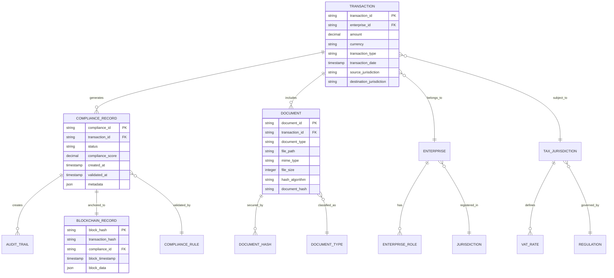

# TaxChain Data Architecture

## Data Architecture Overview


## Core Data Domains

### 1. Compliance Domain

#### Entity Relationship Model


#### Data Specifications

**Transaction Data Model:**
```json
{
  "transaction": {
    "transaction_id": "TXN-2024-001234",
    "enterprise_id": "ENT-DE-5678",
    "transaction_type": "INTRA_EU_GOODS",
    "amount": {
      "value": 15750.00,
      "currency": "EUR"
    },
    "parties": {
      "supplier": {
        "vat_number": "DE123456789",
        "name": "German Manufacturing GmbH",
        "address": {
          "country": "DE",
          "postal_code": "10115",
          "city": "Berlin"
        }
      },
      "customer": {
        "vat_number": "DK87654321",
        "name": "Danish Trading A/S",
        "address": {
          "country": "DK", 
          "postal_code": "1050",
          "city": "Copenhagen"
        }
      }
    },
    "goods": {
      "description": "Industrial machinery parts",
      "hs_code": "8419.90.85",
      "weight": 2850.5,
      "quantity": 15
    },
    "logistics": {
      "incoterms": "CIP",
      "transport_mode": "ROAD",
      "departure_date": "2024-03-15T09:30:00Z",
      "estimated_delivery": "2024-03-17T14:00:00Z"
    }
  }
}
```

### 2. Regulatory Domain

#### VAT Rules Engine Data Model
```json
{
  "vat_rule": {
    "rule_id": "VAT-RULE-EU-001",
    "jurisdiction": "EU",
    "effective_from": "2024-01-01T00:00:00Z",
    "effective_to": null,
    "rule_type": "INTRA_COMMUNITY_SUPPLY",
    "conditions": {
      "supplier_country": ["DE", "FR", "NL", "BE", "IT"],
      "customer_country": ["DK", "SE", "FI", "NO"],
      "goods_category": ["PHYSICAL_GOODS"],
      "minimum_amount": 0,
      "vat_registration_required": true
    },
    "outcomes": {
      "vat_rate": 0.00,
      "vat_treatment": "EXEMPT",
      "documentation_required": [
        "INVOICE",
        "TRANSPORT_DOCUMENT", 
        "PROOF_OF_DELIVERY"
      ],
      "evidence_requirements": {
        "digital_signature": true,
        "blockchain_anchor": true,
        "cryptographic_hash": "SHA256"
      }
    },
    "compliance_score_weight": 0.95
  }
}
```

### 3. Evidence Domain

#### Immutable Evidence Structure
```json
{
  "evidence_record": {
    "evidence_id": "EVD-2024-001234",
    "compliance_id": "CMP-2024-001234", 
    "evidence_type": "PROOF_OF_INTRA_COMMUNITY_DELIVERY",
    "created_timestamp": "2024-03-15T10:45:32Z",
    "documents": [
      {
        "document_id": "DOC-INV-001234",
        "document_type": "COMMERCIAL_INVOICE",
        "hash_algorithm": "SHA256",
        "document_hash": "a665a45920422f9d417e4867efdc4fb8a04a1f3fff1fa07e998e86f7f7a27ae3",
        "digital_signature": {
          "algorithm": "ECDSA-secp256k1",
          "signature": "304502210095...",
          "public_key": "03a1f7c4...",
          "certificate_chain": ["cert1", "cert2"]
        }
      }
    ],
    "blockchain_anchor": {
      "network": "taxchain-fabric",
      "channel": "compliance-channel",
      "transaction_id": "0x7f3c2a1b...",
      "block_number": 847293,
      "block_hash": "0x4d7c9f2e...",
      "merkle_proof": ["hash1", "hash2", "hash3"]
    },
    "verification_status": {
      "cryptographic_integrity": "VERIFIED",
      "blockchain_anchored": "CONFIRMED",
      "regulatory_compliance": "COMPLIANT",
      "audit_ready": true
    }
  }
}
```

## Data Quality Framework

### Data Quality Dimensions

| Dimension | Definition | Measurement | Target |
|-----------|------------|-------------|---------|
| **Accuracy** | Correctness of data values | % of correct values vs validation rules | 99.5% |
| **Completeness** | Presence of required data elements | % of fields populated vs required fields | 98.0% |
| **Consistency** | Uniformity across systems and time | % of consistent values across sources | 97.0% |
| **Timeliness** | Currency and availability of data | Average delay from source to availability | <5 minutes |
| **Validity** | Conformance to defined formats | % of valid formats vs total records | 99.8% |
| **Uniqueness** | Absence of duplicates | % of unique records vs total records | 99.9% |

### Data Validation Rules

#### Input Validation
```javascript
// VAT Number Validation
const validateVATNumber = (vatNumber, country) => {
  const patterns = {
    'DE': /^DE[0-9]{9}$/,
    'DK': /^DK[0-9]{8}$/,
    'FR': /^FR[A-Z0-9]{2}[0-9]{9}$/,
    // ... other EU countries
  };
  
  return patterns[country]?.test(vatNumber) || false;
};

// Amount Validation
const validateAmount = (amount, currency) => {
  return {
    isValid: amount > 0 && Number.isFinite(amount),
    currency: ['EUR', 'USD', 'GBP'].includes(currency),
    precision: (amount.toString().split('.')[1]?.length || 0) <= 2
  };
};

// Date Validation  
const validateTransactionDate = (date) => {
  const transactionDate = new Date(date);
  const now = new Date();
  const maxFutureDate = new Date(now.getTime() + 30 * 24 * 60 * 60 * 1000);
  
  return transactionDate <= maxFutureDate && transactionDate >= new Date('2024-01-01');
};
```

#### Business Rule Validation
```sql
-- Intra-EU Transaction Validation
CREATE OR REPLACE FUNCTION validate_intra_eu_transaction(
    supplier_country VARCHAR,
    customer_country VARCHAR,
    amount DECIMAL,
    vat_rate DECIMAL
)
RETURNS BOOLEAN AS $$
BEGIN
    -- Check if both countries are EU members
    IF NOT (supplier_country IN (SELECT country_code FROM eu_countries) 
            AND customer_country IN (SELECT country_code FROM eu_countries)) THEN
        RETURN FALSE;
    END IF;
    
    -- Check if different countries (intra-community)
    IF supplier_country = customer_country THEN
        RETURN FALSE;
    END IF;
    
    -- Validate VAT exemption for intra-EU supplies
    IF vat_rate != 0.00 THEN
        RETURN FALSE;
    END IF;
    
    -- Check minimum threshold
    IF amount < 1.00 THEN
        RETURN FALSE;
    END IF;
    
    RETURN TRUE;
END;
$$ LANGUAGE plpgsql;
```

## Data Governance Framework

### Data Classification Schema

#### Sensitivity Levels
| Level | Description | Examples | Access Controls |
|-------|-------------|----------|----------------|
| **Public** | Information available to public | VAT rates, regulations | No restrictions |
| **Internal** | Information for internal use | Process metrics, system logs | Employee access only |
| **Confidential** | Sensitive business information | Customer data, transaction amounts | Role-based access |
| **Restricted** | Highly sensitive information | Tax calculations, audit evidence | Privileged access only |
| **Top Secret** | Critical security information | Encryption keys, certificates | Administrator access only |

#### Data Retention Policies
```yaml
data_retention_policy:
  transaction_data:
    retention_period: "10 years"
    archival_after: "2 years" 
    deletion_after: "10 years"
    legal_basis: "Tax regulation compliance"
    
  audit_logs:
    retention_period: "7 years"
    archival_after: "1 year"
    deletion_after: "7 years" 
    legal_basis: "Regulatory audit requirements"
    
  blockchain_records:
    retention_period: "Permanent"
    archival_after: "Never"
    deletion_after: "Never"
    legal_basis: "Immutable evidence requirements"
    
  personal_data:
    retention_period: "6 years"
    archival_after: "1 year"
    deletion_after: "6 years"
    legal_basis: "GDPR compliance"
    subject_rights: ["access", "rectification", "erasure", "portability"]
```

### Data Lineage & Provenance

#### Lineage Tracking Model


## Data Integration Patterns

### API-First Data Integration

#### RESTful API Specification
```yaml
openapi: 3.0.3
info:
  title: TaxChain Data API
  version: 2.0.0
  description: Enterprise data integration API for VAT compliance

paths:
  /v2/transactions:
    post:
      summary: Submit new transaction for compliance processing
      requestBody:
        required: true
        content:
          application/json:
            schema:
              $ref: '#/components/schemas/Transaction'
      responses:
        '201':
          description: Transaction accepted for processing
          content:
            application/json:
              schema:
                $ref: '#/components/schemas/ComplianceResponse'
        '400':
          description: Validation error
          content:
            application/json:
              schema:
                $ref: '#/components/schemas/ValidationError'

  /v2/compliance/{complianceId}/evidence:
    get:
      summary: Retrieve compliance evidence
      parameters:
        - name: complianceId
          in: path
          required: true
          schema:
            type: string
      responses:
        '200':
          description: Evidence retrieved successfully
          content:
            application/json:
              schema:
                $ref: '#/components/schemas/EvidencePackage'

components:
  schemas:
    Transaction:
      type: object
      required:
        - transactionId
        - amount
        - supplierVAT
        - customerVAT
      properties:
        transactionId:
          type: string
          pattern: '^TXN-[0-9]{4}-[0-9]{6}$'
        amount:
          type: object
          properties:
            value:
              type: number
              minimum: 0.01
            currency:
              type: string
              enum: ['EUR', 'USD', 'GBP']
        supplierVAT:
          type: string
          pattern: '^[A-Z]{2}[A-Z0-9]{8,12}$'
        customerVAT:
          type: string
          pattern: '^[A-Z]{2}[A-Z0-9]{8,12}$'
```

### Event-Driven Data Architecture

#### Event Schema Definition
```json
{
  "event_schema": {
    "transaction_created": {
      "event_type": "transaction.created",
      "version": "1.0",
      "payload": {
        "transaction_id": "string",
        "enterprise_id": "string", 
        "amount": "decimal",
        "currency": "string",
        "created_timestamp": "iso8601",
        "source_system": "string"
      },
      "metadata": {
        "correlation_id": "string",
        "causation_id": "string",
        "user_id": "string"
      }
    },
    
    "compliance_validated": {
      "event_type": "compliance.validated", 
      "version": "1.0",
      "payload": {
        "compliance_id": "string",
        "transaction_id": "string",
        "validation_result": "enum[COMPLIANT, NON_COMPLIANT, REQUIRES_REVIEW]",
        "compliance_score": "decimal",
        "rule_violations": "array",
        "validated_timestamp": "iso8601"
      }
    },
    
    "evidence_anchored": {
      "event_type": "evidence.anchored",
      "version": "1.0", 
      "payload": {
        "evidence_id": "string",
        "blockchain_transaction_id": "string",
        "block_hash": "string",
        "anchor_timestamp": "iso8601",
        "immutability_proof": "string"
      }
    }
  }
}
```

## Data Security & Privacy

### Encryption Standards

#### Data at Rest Encryption
```yaml
encryption_config:
  database_encryption:
    algorithm: "AES-256-GCM"
    key_management: "HashiCorp Vault"
    key_rotation_period: "90 days"
    
  file_encryption:
    algorithm: "AES-256-CBC" 
    key_derivation: "PBKDF2"
    iterations: 100000
    
  blockchain_encryption:
    algorithm: "ECDSA-secp256k1"
    hash_function: "SHA-256"
    key_length: 256
```

#### Data in Transit Protection
```yaml
transport_security:
  api_communications:
    protocol: "TLS 1.3"
    cipher_suites: 
      - "TLS_AES_256_GCM_SHA384"
      - "TLS_CHACHA20_POLY1305_SHA256"
    certificate_validation: "strict"
    
  inter_service_communication:
    protocol: "mTLS" 
    certificate_authority: "Internal CA"
    certificate_rotation: "30 days"
    
  blockchain_communication:
    protocol: "gRPC with TLS"
    authentication: "X.509 certificates"
    authorization: "RBAC with JWT"
```

### Privacy by Design Implementation

#### GDPR Compliance Framework
```sql
-- Personal Data Identification
CREATE TABLE personal_data_inventory (
    data_element_id UUID PRIMARY KEY,
    table_name VARCHAR NOT NULL,
    column_name VARCHAR NOT NULL,
    data_category VARCHAR NOT NULL, -- 'IDENTITY', 'CONTACT', 'FINANCIAL', etc.
    sensitivity_level INTEGER NOT NULL, -- 1-5 scale
    legal_basis VARCHAR NOT NULL, -- 'CONSENT', 'CONTRACT', 'LEGAL_OBLIGATION'
    retention_period INTERVAL NOT NULL,
    pseudonymization_required BOOLEAN DEFAULT FALSE,
    encryption_required BOOLEAN DEFAULT TRUE
);

-- Data Subject Rights Implementation  
CREATE TABLE data_subject_requests (
    request_id UUID PRIMARY KEY,
    data_subject_id VARCHAR NOT NULL,
    request_type VARCHAR NOT NULL, -- 'ACCESS', 'RECTIFICATION', 'ERASURE', 'PORTABILITY'
    request_date TIMESTAMP DEFAULT NOW(),
    status VARCHAR DEFAULT 'PENDING',
    completion_date TIMESTAMP,
    response_data JSONB
);

-- Pseudonymization Function
CREATE OR REPLACE FUNCTION pseudonymize_vat_number(vat_number VARCHAR, salt VARCHAR)
RETURNS VARCHAR AS $$
BEGIN
    RETURN 'VAT_' || encode(digest(vat_number || salt, 'sha256'), 'hex');
END;
$$ LANGUAGE plpgsql;
```

---

**Data Architecture Owner**: Chief Data Officer  
**Data Governance Owner**: Data Protection Officer  
**Last Updated**:   
**Next Review**: Quarterly data architecture review